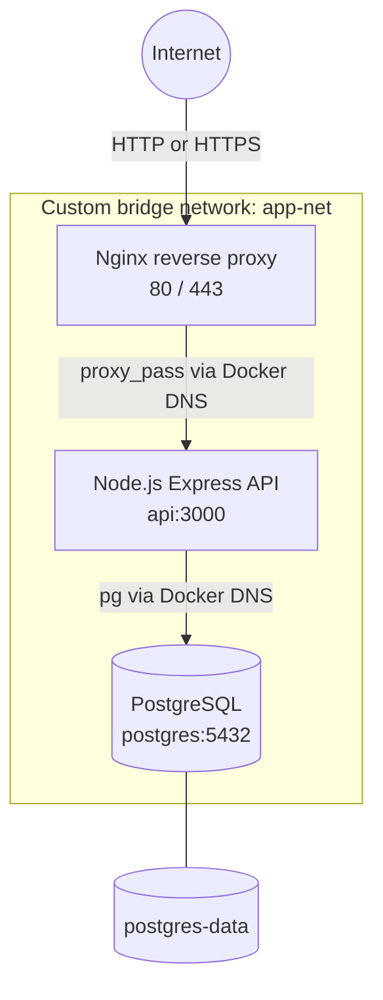

# Docker Nginx Node.js PostgreSQL Demo

## Project Overview

A production-style, single-host three-tier application built with Docker Compose. Nginx is the only public-facing service, an Express API provides application logic, and PostgreSQL stores persistent data on an isolated Docker bridge network.

## Architecture Diagram



Only Nginx publishes host ports. The API and database are accessible solely to containers attached to `app-net`.

## Features

- One-command build and startup with Docker Compose
- Nginx reverse proxy on HTTP and demo HTTPS
- Express API with async database access and centralized error handling
- PostgreSQL schema initialization with five sample users
- Docker health checks and dependency-aware startup
- Explicit user-defined bridge network named `app-net`
- Docker DNS service discovery through `api` and `postgres`
- Persistent PostgreSQL named volume
- Request, query, access, and error logging
- Graceful Node.js shutdown

## Folder Structure

```text
docker-nginx-nodejs-postgres-demo/
|-- README.md
|-- LICENSE
|-- .gitignore
|-- docker-compose.yml
|-- nginx/
|   |-- nginx.conf
|   `-- Dockerfile
|-- api/
|   |-- Dockerfile
|   |-- package.json
|   |-- package-lock.json
|   |-- server.js
|   |-- db.js
|   |-- routes/
|   |   `-- users.js
|   `-- .env.example
|-- postgres/
|   `-- init.sql
|-- docs/
|   |-- architecture.md
|   |-- networking.md
|   |-- deployment.md
|   `-- troubleshooting.md
`-- screenshots/
    `-- placeholder.png
```

## Prerequisites

- Docker Engine with the Compose plugin, or Docker Desktop
- Available host ports 80 and 443
- Git, if you want to clone or publish the repository

Verify Docker before continuing:

```bash
docker --version
docker compose version
```

## Installation

```bash
git clone https://github.com/your-username/docker-nginx-nodejs-postgres-demo.git
cd docker-nginx-nodejs-postgres-demo
```

For local files that have not yet been published, simply open a terminal in the project directory.

## Running the Project

Build and start the complete stack:

```bash
docker compose up -d --build
```

Check service health:

```bash
docker compose ps
```

Open `http://localhost` or test HTTPS with `curl --insecure https://localhost`. HTTPS uses a self-signed certificate generated for this demonstration, so browsers will display a trust warning.

If ports 80 or 443 are already occupied, override only the host bindings, for example with `HTTP_PORT=8080` and `HTTPS_PORT=8443`. The required defaults remain 80 and 443.

Stop the stack without deleting database data:

```bash
docker compose down
```

## API Endpoints

| Method | Endpoint | Description |
| --- | --- | --- |
| GET | `/` | Application identity and status |
| GET | `/health` | API liveness response |
| GET | `/users` | Users read from PostgreSQL |
| GET | `/dbcheck` | Database connectivity and `SELECT NOW()` timestamp |

Examples:

```bash
curl http://localhost/
curl http://localhost/health
curl http://localhost/users
curl http://localhost/dbcheck
```

Expected root response:

```json
{
  "application": "Docker Nginx PostgreSQL Demo",
  "status": "healthy"
}
```

## Docker Networking Explanation

Compose creates the custom user-defined bridge network `app-net` and joins all three services to it. The `ports` section appears only on Nginx, so host traffic cannot connect directly to the API or PostgreSQL. The API and database use `expose` only as documentation of their internal ports; `expose` does not publish a host port.

Inspect the network with:

```bash
docker network inspect app-net
```

## Docker DNS Explanation

Docker provides an embedded DNS server on user-defined networks. Each Compose service name is a stable hostname within the network:

- Nginx sends requests to `api:3000`.
- The API connects to `postgres:5432`.

The application never stores container IP addresses, which may change when containers are recreated.

## Volumes and Persistence

The named volume `postgres-data` is mounted at `/var/lib/postgresql/data`. It survives container recreation and normal `docker compose down` operations.

```bash
docker volume inspect postgres-data
```

`postgres/init.sql` runs only when the database data directory is first initialized. Running `docker compose down -v` deletes the volume and all database data; use it only when you intentionally want a clean reset.

## Security Best Practices

This repository favors a runnable demo while preserving tier isolation. Before a real deployment:

- Replace the demonstration database password with a secret managed outside source control.
- Replace the self-signed TLS certificate with a trusted certificate mounted as a secret.
- Restrict host firewall access to ports 80 and 443.
- Pin and regularly update base images; scan built images for vulnerabilities.
- Back up PostgreSQL and regularly test restores.
- Add authentication, authorization, rate limiting, and input validation for business endpoints.
- Send logs and metrics to monitored, access-controlled systems.
- Consider a non-superuser application database role with only required privileges.

## Screenshots


Replace the placeholder with a screenshot of a successful API response after starting the stack.

## Troubleshooting

Start with service state and logs:

```bash
docker compose ps
docker compose logs --tail=100 postgres api nginx
```

Common issues include host port conflicts, a previously initialized database volume, and local browser warnings for the self-signed certificate. See [the troubleshooting guide](docs/troubleshooting.md) for targeted checks.

## Future Enhancements

- Trusted TLS certificates with automated renewal
- Secret management and separate development/production Compose overrides
- API authentication, authorization, pagination, and validation
- Database migrations and automated backups
- CI workflows for linting, tests, image builds, and vulnerability scanning
- Observability with structured log shipping, metrics, tracing, and alerts
- Multiple API replicas with Nginx load balancing
- Deployment to an orchestrator such as Kubernetes or a managed container platform

## License

This project is available under the [MIT License](LICENSE).
