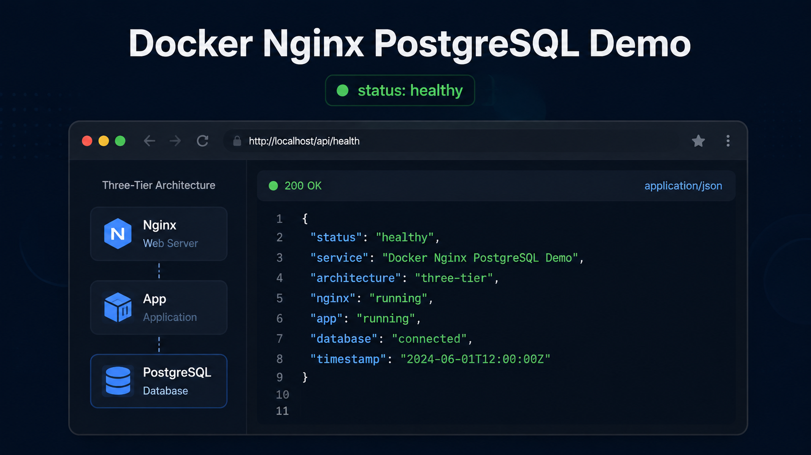
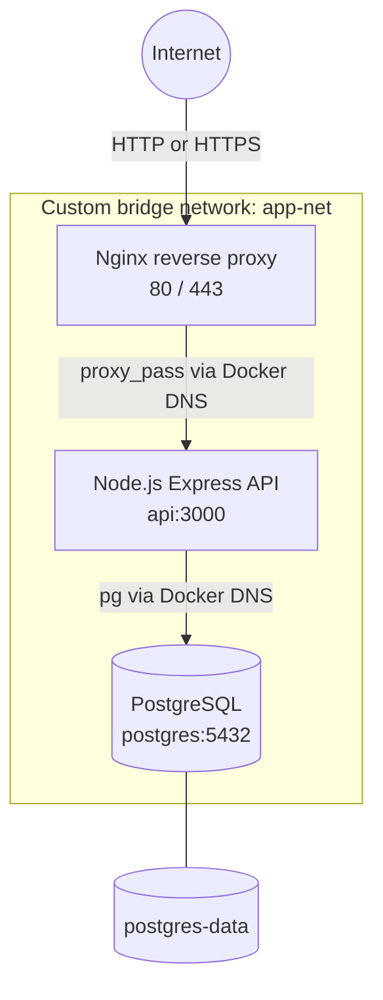
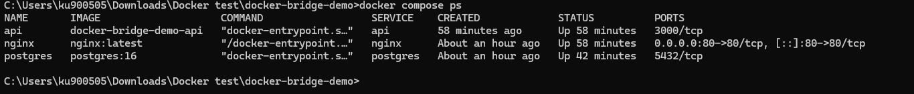

# Docker Bridge Demo

## Project Overview

A production-style, single-host three-tier application built with Docker Compose. Nginx is the only public-facing service, an Express API provides application logic, and PostgreSQL stores persistent data on an isolated Docker bridge network.



## Architecture Diagram



Only Nginx publishes host ports. The API and database are accessible solely to containers attached to `app-net`.

## Components

### Nginx

Nginx is the public reverse proxy and the only service with published ports.

Responsibilities:

- Accept requests from users.
- Forward application requests to `api:3000`.
- Forward the original host, client IP, proxy chain, and protocol headers.
- Apply gzip compression and write access and error logs.
- Terminate demo SSL/TLS connections. The included certificate is self-signed.
- Support static content when a static location is added; the current configuration proxies all routes to the API.

Published ports: `80` and `443`.

### Node.js API

The Express service provides the application tier.

Responsibilities:

- Execute business logic.
- Query PostgreSQL through a bounded connection pool.
- Provide health, user, and database-check endpoints.
- Provide the application layer where authentication and authorization can be added; they are not implemented in this demonstration.

Internal port: `3000`. No host port is published.

### PostgreSQL

PostgreSQL provides persistent relational storage.

Responsibilities:

- Store application data.
- Initialize the `users` table and five sample records.
- Persist the database cluster in the `postgres-data` volume.

Internal port: `5432`. No host port is published.

## Features

- One-command build and startup with Docker Compose
- Nginx reverse proxy on HTTP and demo HTTPS
- Express API with async database access and centralized error handling
- PostgreSQL schema initialization with five sample users
- Docker health checks and dependency-aware startup
- Explicit user-defined bridge network named `app-net`
- Docker DNS service discovery through `api` and `postgres`
- Persistent PostgreSQL named volume
- Request, query, access, and error logging
- Graceful Node.js shutdown

## Folder Structure

```text
docker-bridge-demo/
|-- README.md
|-- LICENSE
|-- .gitignore
|-- docker-compose.yml
|-- nginx/
|   |-- nginx.conf
|   `-- Dockerfile
|-- api/
|   |-- Dockerfile
|   |-- package.json
|   |-- package-lock.json
|   |-- server.js
|   |-- db.js
|   |-- routes/
|   |   `-- users.js
|   `-- .env.example
|-- postgres/
|   `-- init.sql
|-- docs/
|   |-- architecture.md
|   |-- networking.md
|   |-- deployment.md
|   `-- troubleshooting.md
`-- screenshots/
    |-- docker-compose-ps.png
    `-- placeholder.png
```

## Prerequisites

- Docker Engine with the Compose plugin, or Docker Desktop
- Available host ports 80 and 443
- Git, when using the clone method

## Install Docker

Docker Desktop includes Docker Engine, the Docker CLI, and Docker Compose. Linux server users can install Docker Engine and the Compose plugin separately.

### Windows

1. Confirm that the computer meets the [Docker Desktop for Windows requirements](https://docs.docker.com/desktop/setup/install/windows-install/).
2. Enable WSL 2 when required by running `wsl --install` in an administrator terminal, then restart Windows.
3. Download and run Docker Desktop Installer.
4. Select the WSL 2 backend during setup.
5. Start Docker Desktop and wait until Docker Engine reports that it is running.

### macOS

1. Download the correct Intel or Apple silicon package from [Docker Desktop for Mac](https://docs.docker.com/desktop/setup/install/mac-install/).
2. Open the downloaded image and move Docker to Applications.
3. Start Docker and complete the initial setup prompts.

### Linux

1. Select the distribution-specific procedure in the [Docker Engine installation guide](https://docs.docker.com/engine/install/).
2. Install Docker Engine and the Docker CLI from Docker's official package repository.
3. Install the [Docker Compose plugin](https://docs.docker.com/compose/install/linux/).
4. Start and enable the Docker service according to the distribution guide.

### Verify the installation

```bash
docker --version
docker compose version
docker run --rm hello-world
```

The final command should download the test image and print Docker's successful installation message.

## Installation

### Step 1: Download the project

Clone the repository with Git:

```bash
git clone https://github.com/Mahammad-Rafi/docker-bridge-demo.git
```

Alternatively, [download the latest ZIP archive](https://github.com/Mahammad-Rafi/docker-bridge-demo/archive/refs/heads/main.zip), extract it, and open a terminal in the extracted directory.

### Step 2: Enter the project directory

```bash
cd docker-bridge-demo
```

## Deployment Option 1: Docker Compose

### Step 3: Verify Docker

```bash
docker --version
docker compose version
```

Both commands must return version information. Start Docker Desktop or the Docker daemon if either command fails.

### Step 4: Build and deploy the stack

```bash
docker compose up -d --build
```

This command builds the Nginx and API images, pulls PostgreSQL, creates `app-net` and `postgres-data`, and starts all three services.

### Step 5: Confirm container health

```bash
docker compose ps
```

The `postgres`, `api`, and `nginx` services should show `Up` and `healthy`. Only Nginx should display published host ports.



This supplied command-output image demonstrates that the API and PostgreSQL have internal ports only. The current configuration additionally publishes Nginx port 443 and reports health status after the checks complete.

If a service is not healthy, inspect its logs:

```bash
docker compose logs --tail=100 postgres api nginx
```

### Step 6: Test the application endpoint

```bash
curl http://localhost/
```

Expected response:

```json
{
  "application": "Docker Nginx PostgreSQL Demo",
  "status": "healthy"
}
```

### Step 7: Test API health

```bash
curl http://localhost/health
```

Expected response:

```json
{
  "status": "healthy"
}
```

### Step 8: Test PostgreSQL data access

```bash
curl http://localhost/users
```

The response should contain a `users` array with five sample records loaded from `postgres/init.sql`.

### Step 9: Test the database connection

```bash
curl http://localhost/dbcheck
```

Expected response format:

```json
{
  "status": "healthy",
  "timestamp": "<PostgreSQL timestamp>"
}
```

### Step 10: Test HTTPS

```bash
curl --insecure https://localhost/health
```

The response should be `{"status":"healthy"}`. The `--insecure` option is required because the demo Nginx image generates a self-signed certificate. Replace it with a trusted certificate for production.

### Step 11: Verify network isolation and Docker DNS

```bash
docker network inspect app-net
docker compose exec api getent hosts postgres
docker compose exec nginx getent hosts api
```

The network inspection should list all three containers. The DNS commands should resolve `postgres` and `api` to internal container addresses.

Confirm that PostgreSQL is not published to the host:

```bash
docker compose port postgres 5432
```

A successful isolation test returns no host port.

### Step 12: Confirm successful deployment

The deployment is complete when:

- All three services are healthy.
- HTTP and HTTPS requests pass through Nginx.
- `/users` returns five records from PostgreSQL.
- `/dbcheck` returns a database timestamp.
- `api` resolves `postgres`, and `nginx` resolves `api`.
- PostgreSQL port 5432 has no host binding.

If ports 80 or 443 are already occupied, override only the host bindings, for example with `HTTP_PORT=8080` and `HTTPS_PORT=8443`. The required defaults remain 80 and 443.

### Step 13: Stop the stack

Stop the containers without deleting database data:

```bash
docker compose down
```

## Deployment Option 2: Individual Containers

Use this method to understand each Docker resource and container. Do not run it at the same time as the Compose deployment because both methods use the same names, network, volume, and host ports. If Compose is running, stop it first with `docker compose down`.

Run all commands from the repository root.

### Manual Step 1: Create the Docker network

```bash
docker network create app-net
```

This user-defined bridge supplies isolation and Docker DNS service discovery.

### Manual Step 2: Start PostgreSQL

```bash
docker run -d --name postgres --network app-net --restart unless-stopped -e POSTGRES_USER=admin -e POSTGRES_PASSWORD=Password123 -e POSTGRES_DB=appdb -v postgres-data:/var/lib/postgresql/data postgres:16
```

The `-v` option creates or reuses `postgres-data`. There is no `-p` option, so port 5432 is not published.

Wait for PostgreSQL:

```bash
docker exec postgres pg_isready -U admin -d appdb
```

Expected result: `accepting connections`.

### Manual Step 3: Initialize the database

```bash
docker cp postgres/init.sql postgres:/tmp/init.sql
docker exec postgres psql -U admin -d appdb -f /tmp/init.sql
```

Verify the five sample users:

```bash
docker exec postgres psql -U admin -d appdb -c "SELECT id, name, email, created_at FROM users ORDER BY id;"
```

### Manual Step 4: Build the Node.js API image

```bash
docker build -t docker-bridge-demo-api:latest ./api
```

### Manual Step 5: Start the Node.js API

```bash
docker run -d --name api --network app-net --restart unless-stopped -e DB_HOST=postgres -e DB_PORT=5432 -e DB_USER=admin -e DB_PASSWORD=Password123 -e DB_NAME=appdb docker-bridge-demo-api:latest
```

The API uses `postgres` as its database hostname. No API host port is published.

Verify the API container and its logs:

```bash
docker ps --filter name=api
docker logs api
```

### Manual Step 6: Build the Nginx image

```bash
docker build -t docker-bridge-demo-nginx:latest ./nginx
```

### Manual Step 7: Start Nginx

```bash
docker run -d --name nginx --network app-net --restart unless-stopped -p 80:80 -p 443:443 docker-bridge-demo-nginx:latest
```

Nginx resolves the API through the Docker DNS hostname `api` and is the only container that publishes ports.

### Manual Step 8: Verify containers and network membership

```bash
docker ps
docker network inspect app-net
```

The output should list `nginx`, `api`, and `postgres`. Only Nginx should show host mappings for ports 80 and 443.

### Manual Step 9: Test the application

```bash
curl http://localhost/
curl http://localhost/health
curl http://localhost/users
curl http://localhost/dbcheck
curl --insecure https://localhost/health
```

The deployment is successful when the health responses report `healthy`, `/users` returns five records, and `/dbcheck` returns a PostgreSQL timestamp.

### Manual Step 10: Verify private ports

```bash
docker port api 3000
docker port postgres 5432
```

Both commands should return no host binding.

### Manual Step 11: Stop and remove the manual containers

```bash
docker stop nginx api postgres
docker rm nginx api postgres
docker network rm app-net
```

These commands preserve `postgres-data`. To permanently delete the demonstration database, run `docker volume rm postgres-data` only after confirming the data is no longer required.

## API Endpoints

| Method | Endpoint | Description |
| --- | --- | --- |
| GET | `/` | Application identity and status |
| GET | `/health` | API liveness response |
| GET | `/users` | Users read from PostgreSQL |
| GET | `/dbcheck` | Database connectivity and `SELECT NOW()` timestamp |
```

## Docker Networking Explanation

Compose creates the custom user-defined bridge network `app-net` and joins all three services to it. The `ports` section appears only on Nginx, so host traffic cannot connect directly to the API or PostgreSQL. The API and database use `expose` only as documentation of their internal ports; `expose` does not publish a host port.

Inspect the network with:

```bash
docker network inspect app-net
```

## Docker DNS Explanation

Docker provides an embedded DNS server on user-defined networks. Each Compose service name is a stable hostname within the network:

- Nginx sends requests to `api:3000`.
- The API connects to `postgres:5432`.

The application never stores container IP addresses, which may change when containers are recreated.

## Volumes and Persistence

The named volume `postgres-data` is mounted at `/var/lib/postgresql/data`. It survives container recreation and normal `docker compose down` operations.

```bash
docker volume inspect postgres-data
```

`postgres/init.sql` runs only when the database data directory is first initialized. Running `docker compose down -v` deletes the volume and all database data; use it only when you intentionally want a clean reset.

## Security Best Practices

This repository favors a runnable demo while preserving tier isolation. Before a real deployment:

- Replace the demonstration database password with a secret managed outside source control.
- Replace the self-signed TLS certificate with a trusted certificate mounted as a secret.
- Restrict host firewall access to ports 80 and 443.
- Pin and regularly update base images; scan built images for vulnerabilities.
- Back up PostgreSQL and regularly test restores.
- Add authentication, authorization, rate limiting, and input validation for business endpoints.
- Send logs and metrics to monitored, access-controlled systems.
- Consider a non-superuser application database role with only required privileges.

## Screenshots

The overview uses the generated architecture preview. The Compose deployment section uses the supplied `docker compose ps` command output to show the expected service and port layout.

## Troubleshooting

Start with service state and logs:

```bash
docker compose ps
docker compose logs --tail=100 postgres api nginx
```

Common issues include host port conflicts, a previously initialized database volume, and local browser warnings for the self-signed certificate. See [the troubleshooting guide](docs/troubleshooting.md) for targeted checks.

## Future Enhancements

- Trusted TLS certificates with automated renewal
- Secret management and separate development/production Compose overrides
- API authentication, authorization, pagination, and validation
- Database migrations and automated backups
- CI workflows for linting, tests, image builds, and vulnerability scanning
- Observability with structured log shipping, metrics, tracing, and alerts
- Multiple API replicas with Nginx load balancing
- Deployment to an orchestrator such as Kubernetes or a managed container platform

## License

This project is available under the [MIT License](https://github.com/Mahammad-Rafi/docker-bridge-demo/blob/main/LICENSE).
