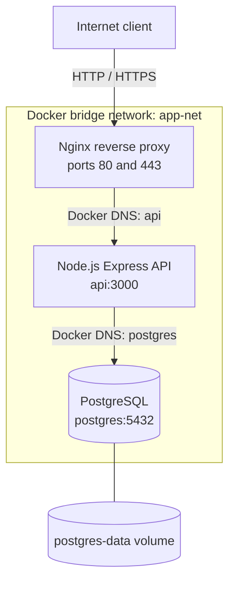

# Architecture

## Overview

This project uses three independently containerized tiers on one Docker host. Nginx is the only public entry point, the Node.js service owns application behavior, and PostgreSQL stores persistent data.

## Reverse proxy tier

Nginx publishes host ports 80 and 443 and proxies every request to `http://api:3000`. It forwards the original host, client address, proxy chain, and protocol headers. Gzip and access/error logging are enabled. The included TLS certificate is self-signed for local demonstration only.

## Application tier

The Express API listens on port 3000 inside `app-net`. It is discoverable by the service name `api`, but it has no host port mapping. It validates database configuration at startup, uses a bounded PostgreSQL connection pool, logs requests and database operations, and handles failures without returning internal error details to clients.

## Database tier

PostgreSQL listens on its normal container port 5432. It is reachable from other containers on `app-net`, but Docker Compose does not publish that port to the host. The `postgres-data` named volume stores the database cluster independently of the container lifecycle.

## Container communication and Docker DNS

Docker Compose attaches every service to the user-defined bridge network `app-net`. Docker's embedded DNS server resolves Compose service names to container addresses. Nginx therefore targets `api:3000`, and the API targets `postgres:5432`; neither component depends on changeable container IP addresses.

`depends_on` with health conditions sequences startup: PostgreSQL must become healthy before the API starts, and the API must become healthy before Nginx starts. This improves startup behavior but does not replace application-level retries for larger production systems.

## Request path

1. A client connects to the Docker host on port 80 or 443.
2. Nginx forwards the request across `app-net` to `api:3000`.
3. Database-backed routes obtain a pooled connection and query `postgres:5432`.
4. The response returns through Nginx to the client.

